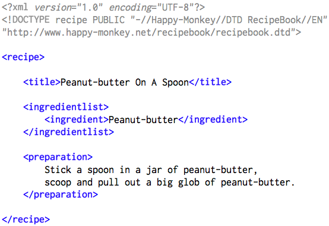

NOTES: 

# Markup Language: 
-> Text encoding system with set of predefined rules that can be converted
   into targetted formats. 

-> Markup language can describe the document formatting. Markdown & Markup? 
   Markdown is a markup library. 
   
-> Example of markdown language: 
   HTML – Hypertext Markup Language.
   KML – Keyhole Markup Language.
   MathML – Mathematical Markup Language.
   SGML – Standard Generalized Markup Language.
   XHTML – eXtensible Hypertext Markup Language.
   XML – eXtensible Markup Language.

# HTML: 

-> Hypertext: any machine readable text 
-> Markup: it is used to describe the structure, format and layout of the webpage

# Pro tips for writing HTML: 

** Block elements: 
   

   <ol> , <ul> , <dl>
   <article> , <section> , 
 

   occupying complete width of the canvas 

** Inline elements: 
   <a> <strong> , <em> , <b> , <i> , <q>, <mark> 

   occupying width upto the size of the rendered element

** If more than one elements are there in any component then collect them
   in a separate "div" tag. 

** Understand box model:  

** Use box-sizing: border-box; 

** Positioning: 

   Parent container: position relative
   Child container: position absolute 
   Then use top and left / right and bottom to align the child 

** extensions: prettier, live server 